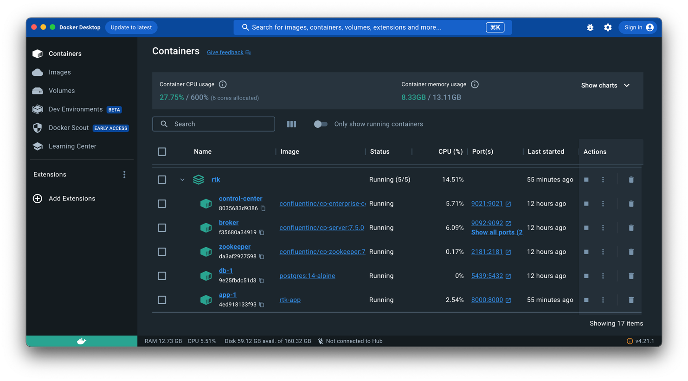

# rtk

Данное приложение представляет из себя мильти-контейнерное приложение, позволяющее принимать информацию о пользователях 
из Kafka и сохраняющее ее (информацию о пользователях) в БД, а также предоставляет API для управления пользователями.

## Запуск приложения

1. создайте виртуальное окружение,
2. установите зависимости:

```shell
pip install -r requirements.txt
```

Это избавит от ошибок импорта при разработке.

3. Создайте файл с конфигами `.env` в директории `src`.  Пример файла с конфигами - [.env.example](src/.env.example).

4. Для первичного запуска и билда (например, для установки новой библиотеки) приложения выполните команду:

```shell
make build
```

Данная команда выполнит команду Docker Compose:

```shell
docker-compose up --build -d
```

Будет запущено приложение на FastAPI, БД Postgres к нему, Zookeeper, брокер Kafka и Control Center:



Чтобы остановить приложение, выполните команду:

```shell
make stop
```

Чтобы рестартануть приложение, выполните команду:

```shell
make start
```

## Ссылки 

- [Swagger](http://localhost:8000/docs)
- [Control Center](http://localhost:9021)

## Тесты

Для запуска тестов выполните команду:

```shell
make test
```
